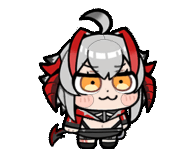
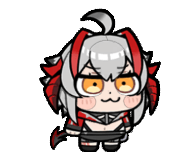

# ViVi Control V0.1

ViVi Control is a cute Windows desktop pet built with Python, Tkinter, Pillow, and high-quality Wisdel GIF assets. It runs as a transparent always-on-top companion with a small control panel for actions, hotkeys, size, drag behavior, and edge peek.



## Preview

| Walk | Relax | Hide |
| --- | --- | --- |
|  |  |  |

## Features

- Borderless transparent desktop pet window
- Cute control panel for actions and settings
- Drag interaction with configurable drag animation, defaulting to `fly`
- Adjustable pet size with lazy frame rebuilding to avoid long stalls
- Autonomous idle behavior with slower state switching
- Higher chance to walk left/right and relax
- Optional edge peek mode: ViVi can hide at screen edges and leave only a small visible tail. It is disabled by default.
- Hidden ViVi can get startled, return to idle, or occasionally walk out by herself
- Hotkeys: `F8` panel, `F9` interact, `F10` edge hide
- Shared animation stage and alpha cleanup to reduce black-edge flashes during action transitions

## Run From Source

```powershell
python -m pip install -r requirements.txt
python viviana_pet.py
```

Or double-click:

```text
run_pet.bat
```

## Build EXE

Double-click:

```text
build_exe.bat
```

The executable will be created at:

```text
dist\ViVi-Control.exe
```

The V0.1 release package includes the executable and the source/assets needed to rebuild it.

## Project Layout

- `viviana_pet.py`: desktop pet and control panel
- `run_pet.bat`: source launcher
- `build_exe.bat`: one-click PyInstaller build
- `皮肤素材/可用素材`: active GIF animations
- `docs/media`: README preview GIFs
- `dist/ViVi-Control.exe`: packaged Windows executable

## Roadmap

Future versions can add AI-powered interaction, including:

- AI vision for recognizing screen context and reacting to what the user is doing
- Voice input and voice response
- More expressive behavior trees and long-term mood state
- Local settings persistence and custom action packs

## Notes

The pet uses transparent GIF cleanup and a shared animation stage to reduce edge artifacts during action transitions. Edge peek is off by default, so ViVi will not unexpectedly disappear; enable it in the panel or press `F10` when you want her to hide.
